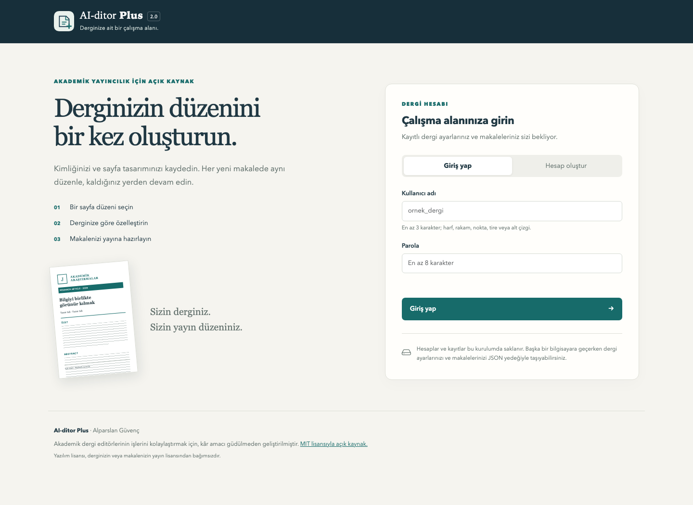
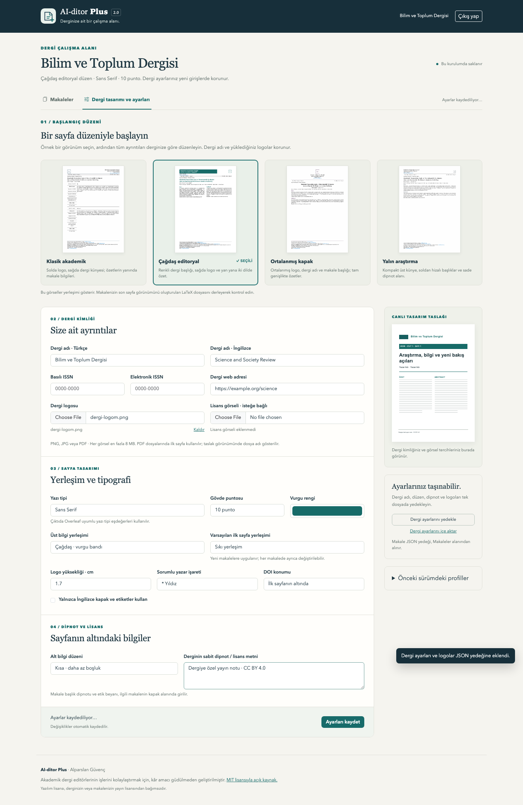

# AI-ditor Plus

**Her dergi için kendi düzeni, kaldığınız yerden devam eden bir çalışma alanı.**

AI-ditor Plus, akademik dergi editörlerinin mizanpaj işlerini kolaylaştırmak için **kâr amacı güdülmeden** geliştirilmiş, **MIT lisanslı açık kaynak** bir masaüstü uygulamasıdır. Bir dergi hesabı oluşturun, örnek sayfa düzenlerinden birini seçin, derginizin kimliğini tanımlayın ve makalelerinizi aynı ön ayarlarla hazırlayın.

Geliştirici: **Alparslan Güvenç** · [MIT lisansı](LICENSE) · [Sürüm notları](CHANGELOG.md)

## İndirme

- [macOS kurulumu](https://github.com/alparslanguvenc/aiditor-plus/releases/latest/download/AIditorPlus_Installer.dmg)
- [Windows kurulumu](https://github.com/alparslanguvenc/aiditor-plus/releases/latest/download/AIditorPlus_Setup.exe)
- [Tüm sürümler ve dosya doğrulama özetleri](https://github.com/alparslanguvenc/aiditor-plus/releases)

macOS'ta DMG içindeki **AI-ditor Plus** uygulamasını **Applications** klasörüne sürükleyin. Windows'ta kurulum dosyasını çalıştırın. Uygulama kendi Python ortamını içerir; kaynak koddan çalıştırmıyorsanız Python kurulumu gerekmez. Windows masaüstü penceresi Microsoft Edge WebView2 kullanır. macOS uygulaması Apple noter onayına sahip değildir; ilk açılışta Sistem Ayarları → Gizlilik ve Güvenlik bölümünden izin vermenizi isteyebilir.

## 2.0 ile gelenler

- **Dergi hesabı:** Kullanıcı adı ve parola ile giriş; her hesapta ayrı dergi ayarları, logolar ve makale taslakları.
- **Dört başlangıç düzeni:** Klasik akademik, çağdaş editoryal, ortalanmış kapak ve yalın araştırma. Görsel sayfa örneklerinden seçim yapıp daha sonra özelleştirebilirsiniz.
- **Kalıcı dergi kimliği:** Türkçe/İngilizce ad, ISSN/e-ISSN, web adresi, logo ve logo boyutu, vurgu rengi, yazı tipi, punto, DOI konumu, sorumlu yazar işareti ve dipnot düzeni.
- **Makale arşivi ve otomatik kayıt:** Yarım kalan taslaklar diske kaydedilir. Aynı makale iki pencerede değişirse sessizce üzerine yazılmaz; ayrı kopya olarak koruyabilirsiniz.
- **Word içe aktarma:** `.docx` içindeki bölümler, paragraflar, tablolar ve desteklenen görseller kaynak sırasıyla düzenleyiciye taşınır.
- **Zengin tablo düzenleme:** Word/Excel'den yapıştırma, birleşik hücreler, hizalama, kalın/italik yazı, renkler ve uzun tablolar. Eski düz metin tabloları da desteklenir.
- **Bölümleri taşıma:** Sürükle bırak veya klavye ile sıralama; şekil ve tablo bağlantıları bölüm adı değişince kaybolmaz.
- **Kapak sığdırma:** Otomatik, sıkı ve yoğun seçenekleri; ilk sayfada makale bilgileri ve dipnot alanının birlikte düzenlenmesi.
- **Taşınabilir yedekler:** Dergi ön ayarları/logoları ve makale projeleri için JSON aktarımı. Eski Plus profillerini hesaba açıkça içe aktarabilirsiniz.
- **Overleaf çıktısı:** `main.tex`, gerekli görseller ve kullanım açıklaması içeren ZIP.





## İlk kullanım

1. **Hesap oluştur** sekmesinden dergi adını, kullanıcı adını ve parolayı belirleyin.
2. **Dergi ayarları** bölümündeki dört örnekten birini seçin. Seçimden sonra adı, logo, renk, tipografi ve dipnot alanlarını düzenleyin.
3. Kayıt göstergesinde ayarların kaydedildiğini görün. Sonraki girişinizde bu ayarlar geri gelir.
4. Yeni makale açın veya Word belgenizi içe aktarın. Makaleye özgü yazar, tarih, cilt/sayı, başlık, özet, etik beyan ve kaynakça bilgilerini kontrol edin.
5. **ZIP oluştur** ile çıktıyı indirin. Overleaf'te **New Project → Upload Project** yoluyla yükleyin ve derleyiciyi **XeLaTeX** seçin.

Word aktarımı düzenleme başlangıcıdır; resim olarak çizilmiş tablolar, Word şekilleri ve metin kutuları her belgede doğrudan çıkarılamayabilir. İçeriği, başlıkları, tablo sırasını ve görselleri çıktı öncesinde kontrol edin. Eksik etik beyan veya makale lisansı uygulama tarafından kendiliğinden doldurulmaz.

## Hesaplar ve veriler nerede?

Hesaplar **bu bilgisayardaki AI-ditor Plus kurulumuna aittir**. E-posta doğrulaması, bulut hesabı, cihazlar arasında otomatik eşitleme veya internet üzerinden ortak düzenleme bulunmaz. Amaç dergi ön ayarlarını ve makale taslaklarını düzenli biçimde saklamaktır. Uygulama yalnızca yerel bilgisayar adresinde çalışır.

Veriler uygulama paketinin dışında tutulduğu için sürüm güncellemesi dergi ayarlarını silmez:

| Sistem | Varsayılan veri klasörü |
| --- | --- |
| macOS | `~/Library/Application Support/AI-ditor Plus/` |
| Windows | `%LOCALAPPDATA%/AI-ditor Plus/` |
| Linux | `$XDG_DATA_HOME/aiditor-plus/` veya `~/.local/share/aiditor-plus/` |

Başka bilgisayara geçerken dergi ön ayarlarını ve makale projelerini JSON olarak dışa aktarın, yeni kurulumda hesap oluşturup dosyaları içe aktarın. Tam yerel yedek için uygulama kapalıyken veri klasörünün tamamını kopyalayın. Parolalar açık metin olarak saklanmaz; bu yerel hesap sistemi işletim sistemi düzeyindeki disk erişiminin yerine geçmez. Eski `~/.aiditor_plus/profiles/` dosyaları otomatik silinmez.

**JGTTR Formatter bağımsız bir uygulamadır.** AI-ditor Plus farklı veri klasörü, uygulama kimliği ve çalışma alanı kullanır.

## Kaynak koddan çalıştırma

Python 3.11 veya üzeri:

```sh
python3 -m venv .venv
source .venv/bin/activate
python -m pip install -r requirements-desktop.txt
python app.py
```

Windows'ta ortamı `.venv\Scripts\activate` ile etkinleştirin. Sadece tarayıcıda kullanmak için `python app.py --browser`; tarayıcıyı otomatik açmadan başlatmak için `python app.py --no-browser --port 5051` kullanın. Meşgul bir bağlantı noktasındaki başka süreçler sonlandırılmaz.

Test verilerini kişisel verilerden ayırmak için `AIDITOR_DATA_DIR` ortam değişkenine ayrı bir klasör verin.

```sh
python -m pip install -r requirements-dev.txt
python -m unittest discover -s tests -q
python -m playwright install chromium
python tests/browser_workflow.py
python tests/browser_races.py
```

macOS paketi: `bash build_mac.sh` · Windows paketi: `build_windows.bat` (Inno Setup gerektirir). GitHub Actions, değişikliklerde testleri; sürüm etiketlerinde macOS ve Windows paketlerini çalıştırır. Sürüm dosyaları her iki paket ve kontroller başarılı olduğunda yayımlanır.

## Lisans ve amaç

Bu proje akademik dergi editörlerinin işlerini kolaylaştırmak amacıyla, **kâr amacı güdülmeden** geliştirilmiştir. Yazılım **MIT lisansıyla** yayımlanır. Bu geliştirme amacı MIT'nin verdiği kullanım, değiştirme ve dağıtım haklarına ek bir kısıtlama getirmez. Yazılım lisansı, hazırladığınız makalelerin veya derginizin yayın lisansını belirlemez; makale lisansı ve lisans görseli dergi tarafından seçilir.

Copyright © 2025–2026 Alparslan Güvenç.
